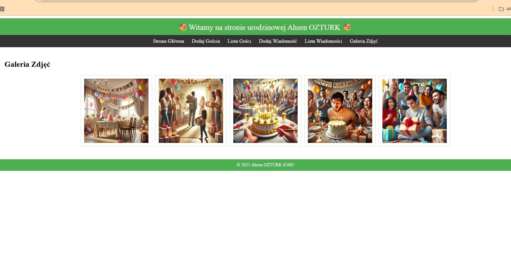

 Birthday Website Project

This is a simple web application built as a birthday-themed site using **HTML**, **CSS**, **PHP**, and **MySQL**. It features a guestbook, a gallery, and interactive message functionality.

Features

-  Birthday landing page  
-  Submit and view birthday messages  
- Gallery section for birthday visuals  
-  MySQL database integration (SQL file included)

 Project Structure
 
 L15_Ozturk_65685_kol2/
│
├── CSS_AO/ → Styling
├── DB_Include_AO/ → DB connection scripts
├── DB_Work_AO/ → MySQL query logic
├── Img_AO/ → Images
├── Main_PHP_AO/ → Core PHP logic
├── SQL_AO/ → Database file (company.AO.sql)
├── start.AO.html → Static intro page
└── start.AO.php → Main app entry

 How to Run?

1. Move the project folder into `htdocs` (XAMPP).
2. Start Apache and MySQL via XAMPP.
3. Open `phpMyAdmin` and import the `company.AO.sql` file.
4. In your browser, go to:  
   `http://localhost/L15_Ozturk_65685_kol2/Main_PHP_AO/start.AO.php`

